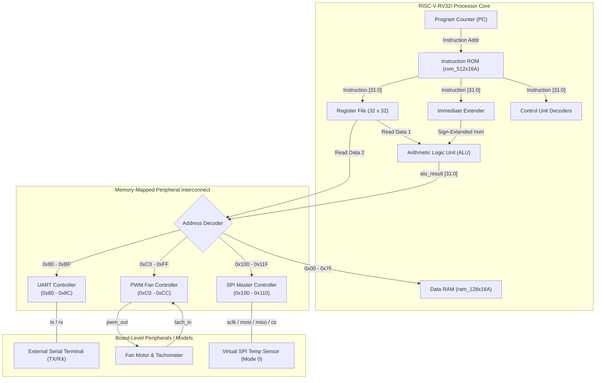
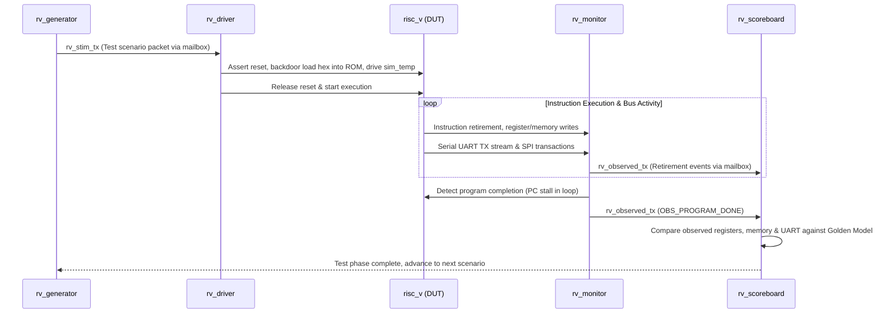

# 32-bit Single-Cycle RISC-V SoC with UART, PWM, SPI & Layered SV Testbench

A 32-bit single-cycle **RISC-V (RV32I subset)** System-on-Chip (SoC) designed in synthesizable Verilog/SystemVerilog, targeting the **TSMC 0.18µm (CL018G)** ASIC process with hard memory macros.

The SoC integrates a high-performance single-cycle CPU datapath with memory-mapped I/O (MMIO) peripherals, including an asynchronous **UART Controller**, a **PWM Fan Controller** with tachometer speed feedback, and an **SPI Master** interfaced with an external virtual temperature sensor for closed-loop thermal regulation.

---

## Table of Contents
1. [Key Features](#key-features)
2. [SoC Architecture](#soc-architecture)
3. [Memory Map & MMIO Registers](#memory-map--mmio-registers)
4. [Directory Structure](#directory-structure)
5. [Instruction Set Support](#instruction-set-support)
6. [Layered SystemVerilog Verification Suite](#layered-systemverilog-verification-suite)
7. [Simulation & Verification Guide](#simulation--verification-guide)
8. [ASIC Implementation Flow](#asic-implementation-flow)

---

## Key Features

- **RISC-V RV32I Core:**
  - 32-bit single-cycle datapath with dedicated instruction fetch, decode, ALU, and data memory stages.
  - 32 general-purpose registers (`x0` hardwired to zero).
  - Configurable core clock divider (`clk_div.v`) providing clean instruction execution clocking (`clk_d`).
  - Parameterizable instruction memory with backdoor runtime hex loading.
- **Memory-Mapped Peripherals:**
  - **UART Controller (`0x80 - 0x8C`):** Full-duplex asynchronous serial transceiver with configurable baud rate, start/stop bit validation, and status polling.
  - **PWM Fan Controller (`0xC0 - 0xCC`):** Programmable frequency and duty cycle (0–100%), hardware tachometer edge-timing accumulator, and stall detection interrupt (`pwm_stall_irq`).
  - **SPI Master (`0x100 - 0x110`):** SPI Mode 0 (CPOL=0, CPHA=0) master controller with programmable clock divider (`SPI_CLKDIV`) and interrupt/busy status flags.
  - **Virtual Temperature Sensor:** Dynamic SPI slave modeling an on-board thermal sensor feeding real-time telemetry to the CPU.
- **Dual Verification Environments:**
  - **Layered SystemVerilog Testbench (`tb/layered/`):** Modular, decoupled UVM-style verification environment featuring an autonomous generator, driver, passive monitor, clocking-block interface, and self-checking scoreboard with golden models for 6 directed test scenarios.
  - **Dedicated Testbench Suite (`tb/`):** Comprehensive unit tests covering ISA instructions, UART edge cases, hardware loopback, and closed-loop thermal PWM control.
- **ASIC Implementation Ready:**
  - Integrated with **TSMC 0.18µm** technology libraries (`slow.lib`, `typical.lib`, `fast.lib`, `all.lef`).
  - Complete backend flow scripts: Cadence Genus synthesis, Cadence Conformal LEC, and Cadence Innovus Place & Route.

---

## SoC Architecture



---

## Memory Map & MMIO Registers

The system bus utilizes 32-bit byte-addressed memory mapping. The address decoder partitions the memory space based on the computed `alu_result`:

| Address Range | Device / Subsystem | Description |
| :--- | :--- | :--- |
| `0x0000_0000 – 0x0000_007F` | **Data Memory (RAM)** | Internal 64/128-byte SRAM for variables, stack, and results |
| `0x0000_0080 – 0x0000_00BF` | **UART Subsystem** | Serial TX/RX control, data, and status registers |
| `0x0000_00C0 – 0x0000_00FF` | **PWM Controller** | Fan drive, duty cycle control, and tachometer feedback |
| `0x0000_0100 – 0x0000_011F` | **SPI Master** | Serial Peripheral Interface control and telemetry registers |

### 1. UART Registers (`0x80 – 0x8C`)

| Address | Name | Access | Bit Fields & Function |
| :--- | :--- | :--- | :--- |
| `0x80` | `UART_TX_DATA` | Write | `[7:0]` Byte to transmit over serial TX line |
| `0x84` | `UART_TX_STATUS`| Read | `[0]` TX Ready: `1` when transmitter is idle and ready for next byte |
| `0x88` | `UART_RX_DATA` | Read | `[7:0]` Last byte received from serial RX line |
| `0x8C` | `UART_RX_STATUS`| Read | `[0]` RX Valid: `1` when a received byte is waiting in buffer |

### 2. PWM Controller Registers (`0xC0 – 0xCC`)

| Address | Name | Access | Bit Fields & Function |
| :--- | :--- | :--- | :--- |
| `0xC0` | `PWM_CTRL` | R/W | `[0]` Enable PWM, `[1]` Invert output, `[2]` Enable Tachometer, `[3]` Clear Error |
| `0xC4` | `PWM_DUTY` | R/W | `[7:0]` Duty cycle percent (`0` to `100`, hardware clamped) |
| `0xC8` | `PWM_STATUS` | Read | `[0]` Active status, `[1]` Fan stall error, `[2]` Tachometer period valid |
| `0xCC` | `PWM_TACH_PERIOD` | Read | `[31:0]` System clock cycles between consecutive tachometer pulses |

### 3. SPI Master Registers (`0x100 – 0x110`)

| Address | Name | Access | Bit Fields & Function |
| :--- | :--- | :--- | :--- |
| `0x100` | `SPI_CTRL` | R/W | `[0]` Master Enable, `[1]` Start Transfer (self-clearing pulse) |
| `0x104` | `SPI_TXDATA` | R/W | `[7:0]` Byte to transmit over MOSI pin |
| `0x108` | `SPI_RXDATA` | Read | `[7:0]` Last byte received from MISO pin (temperature telemetry) |
| `0x10C` | `SPI_STATUS` | Read | `[0]` Busy (`1` while serial transaction active), `[1]` Transfer Done |
| `0x110` | `SPI_CLKDIV` | R/W | `[15:0]` SCLK divider count ($f_{sclk} = \frac{f_{clk}}{2 \times \text{DIV}}$) |

---

## Directory Structure

```
RISC_V/
├── rtl/                        # Synthesizable RTL modules
│   ├── risc_v.v                # Top-level SoC integration
│   ├── adder.v                 # PC + 4 & branch adder
│   ├── alu.v                   # 32-bit Arithmetic Logic Unit
│   ├── alu_control.v           # ALU operation decoder
│   ├── clk_div.v               # Core clock divider (clk -> clk_d)
│   ├── control_unit.v / cu.v   # Main instruction decoder
│   ├── data_mem.v              # Data memory interface
│   ├── imm_ext.v               # Immediate generator (I, S, B, U, J)
│   ├── instr_mem.v             # Instruction memory with hex loader
│   ├── mux.v                   # Datapath multiplexers
│   ├── pc.v                    # Program Counter register
│   ├── pwm_regs.v              # MMIO PWM fan controller
│   ├── reg_file.v              # 32x32-bit dual-read register file
│   ├── spi_reg.v               # MMIO SPI Master controller
│   ├── uart_regs.v             # MMIO UART register wrapper
│   ├── uart_rx.v               # UART receiver
│   ├── uart_tx.v               # UART transmitter
│   └── virtual_temp_sensor.v   # Virtual SPI temperature sensor model
├── tb/                         # Verification testbenches
│   ├── layered/                # Layered SystemVerilog testbench suite
│   │   ├── rv_if.sv            # Testbench interface with clocking blocks
│   │   ├── rv_layered_pkg.sv   # Stimulus/Observed transactions & Scoreboard
│   │   ├── rv_generator.sv     # Test stimulus generator
│   │   ├── rv_driver.sv        # Cycle-accurate driver & backdoor loader
│   │   ├── rv_monitor.sv       # Passive datapath & serial monitor
│   │   ├── rv_environment.sv   # Environment container
│   │   └── rv_layered_tb.sv    # Top-level layered test harness
│   ├── risc_v_isa_tb.v         # Core instruction verification
│   ├── risc_v_uart_full_tb.v   # Full CPU + UART loopback & reset recovery
│   ├── risc_v_uart_tb.v        # CPU UART TX streaming testbench
│   ├── uart_edge_tb.v          # UART framing/glitch edge cases
│   └── uart_loopback_tb.v      # Standalone UART TX->RX loopback test
├── assembly_codes/             # Assembly test sources & compiled hex
│   ├── cpu_arithmetic_logic.s  # ALU arithmetic/logic tests (.hex)
│   ├── cpu_branches_loops.s    # Branching (BEQ/BNE) & loops (.hex)
│   ├── cpu_memory_access.s     # RAM load/store integrity (.hex)
│   ├── uart_tx_hello.s         # UART "Hello, RISC-V!" string output (.hex)
│   ├── full_soc_test.s         # End-to-end SoC test (.hex)
│   ├── spi_temp_test.s         # SPI sensor query & PWM MMIO test (.hex)
│   └── README.md               # Assembly test documentation
├── functional_test/            # Closed-loop thermal PWM & telemetry suite
│   ├── risc_v_temp_pwm_tb.v    # Dedicated closed-loop testbench
│   ├── pwm_temp_control.s      # Thermal regulation assembly source
│   ├── pwm_temp_control.hex    # Assembled machine code
│   └── run_temp_pwm_sim.do     # ModelSim / Questa simulation script
├── sim/                        # Simulation automation & ModelSim scripts
│   ├── run_tests.ps1           # Automated PowerShell regression suite runner
│   ├── run_layered.do          # Layered testbench DO script with wave dividers
│   ├── run_all_tests.do        # Batch runner for standalone testbenches
│   ├── run_hex_sim.do          # Hex-loading simulation runner
│   ├── run_uart_sim.do         # UART streaming testbench DO script
│   └── run_loopback.do         # UART loopback testbench DO script
├── macro_models/               # TSMC 0.18um Memory Macro Behavioral Models
│   ├── rom_512x16A.v           # 2 KB Instruction ROM macro model
│   └── ram_128x16A.v           # 512 B Data RAM macro model
├── synthesis/                  # ASIC Logic Synthesis (Cadence Genus)
│   └── run_genus.tcl           # Genus synthesis automation script
├── physical_design/            # ASIC Physical Implementation (Cadence Innovus)
│   ├── run_innovus_full.tcl    # Complete automated P&R flow
│   ├── 01_init_design.tcl      # Floorplan initialization & LEF loading
│   ├── 02_floorplan.tcl        # Macro placement & core boundary setup
│   ├── 03_power_plan.tcl       # Power rings & stripes generation
│   ├── 04_placement.tcl        # Standard cell placement & optimization
│   ├── 05_cts.tcl              # Clock Tree Synthesis
│   ├── 06_route.tcl            # NanoRoute detail routing
│   ├── 07_signoff.tcl          # Timing & DRC/LVS signoff
│   └── 08_export.tcl           # GDSII & Netlist export
├── lec/                        # Logic Equivalence Checking (Conformal LEC)
│   ├── run_lec.do              # Golden RTL vs Synthesized Netlist LEC script
│   └── lec.do                  # Batch comparison script
└── constraints/                # Timing constraints
    └── constraints.sdc         # Clock definitions, I/O delays, false paths
```

---

## Instruction Set Support

The processor implements the RV32I subset of the RISC-V specification:

| Type | Instruction | Opcode | Funct3 | Funct7 | Description |
| :--- | :--- | :--- | :--- | :--- | :--- |
| **R-Type** | `ADD` | `0110011` | `0x0` | `0x00` | Addition: $rd = rs1 + rs2$ |
| | `SUB` | `0110011` | `0x0` | `0x20` | Subtraction: $rd = rs1 - rs2$ |
| | `AND` | `0110011` | `0x7` | `0x00` | Bitwise AND: $rd = rs1 \ \& \ rs2$ |
| | `OR` | `0110011` | `0x6` | `0x00` | Bitwise OR: $rd = rs1 \ \| \ rs2$ |
| | `SLT` | `0110011` | `0x2` | `0x00` | Set Less Than (signed): $rd = (rs1 < rs2) \ ? \ 1 : 0$ |
| | `SLL` | `0110011` | `0x1` | `0x00` | Shift Left Logical: $rd = rs1 \ll rs2[4:0]$ |
| | `SRL` | `0110011` | `0x5` | `0x00` | Shift Right Logical: $rd = rs1 \gg rs2[4:0]$ |
| | `SRA` | `0110011` | `0x5` | `0x20` | Shift Right Arithmetic: $rd = rs1 \gg_{arith} rs2[4:0]$ |
| **I-Type** | `ADDI` | `0010011` | `0x0` | — | Add Immediate: $rd = rs1 + \text{imm}$ |
| | `ANDI` | `0010011` | `0x7` | — | Bitwise AND Immediate: $rd = rs1 \ \& \ \text{imm}$ |
| | `ORI` | `0010011` | `0x6` | — | Bitwise OR Immediate: $rd = rs1 \ \| \ \text{imm}$ |
| | `SLTI` | `0010011` | `0x2` | — | Set Less Than Immediate: $rd = (rs1 < \text{imm}) \ ? \ 1 : 0$ |
| | `LW` | `0000011` | `0x2` | — | Load Word: $rd = \text{mem}[rs1 + \text{imm}]$ |
| **S-Type** | `SW` | `0100011` | `0x2` | — | Store Word: $\text{mem}[rs1 + \text{imm}] = rs2$ |
| **B-Type** | `BEQ` | `1100011` | `0x0` | — | Branch Equal: if $(rs1 == rs2)$ then $PC = PC + \text{imm}$ |
| | `BNE` | `1100011` | `0x1` | — | Branch Not Equal: if $(rs1 \neq rs2)$ then $PC = PC + \text{imm}$ |

---

## Layered SystemVerilog Verification Suite

The layered testbench (`tb/layered/`) provides automated, self-checking verification:



### Directed Test Scenarios

1. **`alu_test`:** Exercises R-type arithmetic, logic, signed comparison, and shifts. Checks 17 registers and 6 RAM words.
2. **`mem_test`:** Verifies Data RAM store and load (`SW` and `LW`) data integrity and accumulation across memory words. Checks 9 registers and 5 RAM words.
3. **`branch_test`:** Verifies conditional branching logic (`BEQ`, `BNE`), loop counters, and forward branch resolution. Checks 6 registers and 2 RAM words.
4. **`uart_test`:** Verifies MMIO UART status polling and serial character output. Checks for the transmitted string `"Hello"`.
5. **`full_soc_test`:** End-to-end SoC test combining compute, memory store/load, conditional validation, and UART confirmation (`"OK"`).
6. **`spi_temp_test`:** Configures the SPI master clock divider, enables the SPI master, reads temperature telemetry from the virtual sensor (`25` / `0x19`), exercises the PWM MMIO register bank, stores results in RAM, and transmits `"SPI TEMP 25C OK\n"` over UART.

---

## Simulation & Verification Guide

### Prerequisites
- **Simulator:** Siemens QuestaSim / ModelSim (vsim 2020.1+ recommended).
- **Environment:** Windows PowerShell (or Linux bash with tool paths configured).

### 1. Run the Complete Automated Regression Suite
Execute all 13 test suites (unit testbenches, edge cases, thermal regulation, and layered tests) with a single command:

```powershell
powershell -ExecutionPolicy Bypass -File sim/run_tests.ps1
```

### 2. Run the Layered Testbench

#### Run All 6 Layered Tests (Batch Headless)
```powershell
vsim -c -do "do sim/run_layered.do; quit -f"
```

#### Run All 6 Layered Tests (Interactive GUI with Waves)
```powershell
vsim -do sim/run_layered.do
```

#### Run a Specific Test Scenario
```powershell
vsim -c -do "do sim/run_layered.do spi_temp_test; quit -f"
vsim -c -do "do sim/run_layered.do alu_test; quit -f"
vsim -c -do "do sim/run_layered.do mem_test; quit -f"
vsim -c -do "do sim/run_layered.do branch_test; quit -f"
vsim -c -do "do sim/run_layered.do uart_test; quit -f"
vsim -c -do "do sim/run_layered.do full_soc_test; quit -f"
```

### 3. Run Standalone Testbenches

#### Dynamic Hex Loading Testbench
```powershell
vsim -c -do "run -all; quit -f" work.risc_v_hex_tb +HEX=assembly_codes/full_soc_test.hex
vsim -c -do "run -all; quit -f" work.risc_v_hex_tb +HEX=assembly_codes/cpu_arithmetic_logic.hex
```

#### Closed-Loop Thermal PWM & Telemetry Testbench
```powershell
vsim -c -do functional_test/run_temp_pwm_sim.do
```

#### UART Edge Cases & Hardware Loopback
```powershell
vsim -c -do sim/run_uart_sim.do
vsim -c -do sim/run_loopback.do
```

---

## ASIC Implementation Flow

The design includes a complete digital backend flow targeting **TSMC 0.18µm** using Cadence tools:

### 1. Logic Synthesis (Cadence Genus)
Synthesizes the RTL design to gate-level netlist using the TSMC 0.18µm standard cell library while preserving RAM and ROM hard macros as leaf cells:

```bash
genus -f synthesis/run_genus.tcl
```
- **Outputs:** `synthesis/output/risc_v_netlist.v`, `risc_v_constraints.sdc`, area and timing reports.

### 2. Formal Equivalence Checking (Cadence Conformal LEC)
Formally proves that the synthesized gate-level netlist is logically equivalent to the golden RTL:

```bash
lec -f lec/run_lec.do
```

### 3. Physical Design / Place & Route (Cadence Innovus)
Executes the full place and route flow: floorplanning, macro placement, power distribution rings/stripes, standard cell placement, Clock Tree Synthesis (CTS), detail routing, and signoff DRC/timing:

```bash
innovus -files physical_design/run_innovus_full.tcl
```
- **Outputs:** `physical_design/output/risc_v_post_route.v`, GDSII, SPEF parasitics, and signoff timing reports.

---

## License

This project is developed for educational, academic, and research purposes. Refer to repository licensing guidelines for commercial reuse.
